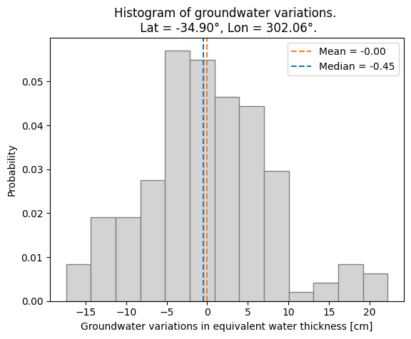
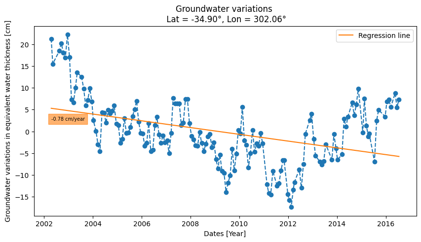

# :artificial_satellite:  Groundwater storage changes

## About

The goal of this project is to process and integrate data from satellites and hydrological models in order to obtain groundwater storage variations for the period 2002-2016 in the Chaco-Pampean plain, the most populated and productive area in Argentina.

This study was part of my degree thesis in Geophysics (Quindimil, 2018).

It consists of a set of six scripts written in Python 3.

### Data

The data used in this project was collected from two different sources:

- Monthly mass grids (level 3) from the Gravity Recovery and Climate Experiment (GRACE) in netCDF format. Release RL05, accessed in 2017. Newer release freely available on [https://grace.jpl.nasa.gov/](https://grace.jpl.nasa.gov/), supported by the NASA's MEaSUREs Program (Landerer & Swenson, 2012; Landerer, 2021).
- Products from the Global Land Data Assimilation System (GLDAS) in netCDF format. Version 2.1, accessed in 2017. Newer version freely available on [https://disc.gsfc.nasa.gov/](https://disc.gsfc.nasa.gov/) (Rodell et al., 2004; Beaudoing & Rodell, 2020).

Grids: 1° (latitude) x 1° (longitude). Temporal resolution: Month.

### Conceptual model

The variations in groundwater storage can be estimated using the following equation (Rodell et al., 2007):

ΔSGW = ΔS - (ΔSSM + ΔSC),   

where ΔSGW are groundwater storage changes, ΔS are terrestrial water storage variations from GRACE, ΔSSM are soil moisture changes from GLDAS and ΔSC are canopy water storage variations from GLDAS.

## Technologies used

Python 3
- Libraries: NumPy, Matplotlib, Pandas, SciPy, Scikit-learn. 
- Modules: Datetime, Dateutil.
- Package: Cartopy, Shapely.

## How to use

### Scripts

This project contains the scripts listed in the table below.

| Name | Funcionality |
| ---- | ----- |
| `functions.py` | Helper functions for estimating groundwater storage changes. |
| `dgw_calculation.py` | Data loading and processing to calculate groundwater storage variations for the study region and period. Input: NetCDF files from the Data section. |
| `dgw_animation.py` | Generation of an animation with maps of groundwater storage variations for each date. |
| `dgw_point.py` | Spatial interpolation to obtain groundwater storage changes at a specific point on land. |
| `monthly_mean.py` | Creation of monthly mean maps of groundwater storage variations for the study area. |
| `annual_mean.py` | Creation of annual mean maps of groundwater storage variations for the study area. |

### Run 
These are the instructions on how to run the scripts.

1. Put all `.py` files in the same folder.
2. Execution of the script `dgw_calculation.py`.

       $python3 dgw_calculation.py

   It generates a file named `dgw.npz` that contains `dgw_filtered_data.npy`, `dgw_filtered_mask.npy`, `time.npy`, `lon.npy` and `lat.npy` arrays, required to run the other codes (except for `functions.py`).
3. Run any of the remaining scripts.

## Examples of use

### Analysis of month-to-month groundwater storage changes

This animation shows groundwater storage variations month by month during the period 2002-2016.
The bluer, the greater the increase in groundwater storage. The redder, the opposite. 

About the maps: The yellow polygon was created in QGIS based on the map presented by Sayago (1995). The shapefile of the provinces was downloaded from [Instituto Geográfico Nacional de la República Argentina](https://www.ign.gob.ar/).

### Analysis of groundwater storage variation in La Plata, Argentina

The histogram below provides a visual representation of data distribution. Considering the period 2002-2016, groundwater storage ranged between -15 and 20 cm. The mean value was around 0 cm.

The following graph presents the variations of groundwater storage in La Plata over the study period. The drawn regression line shows a decrease in groundwater storage at a rate of 78 cm per year.

## References

- Beaudoing, H. and M. Rodell, NASA/GSFC/HSL (2020), GLDAS Noah Land Surface Model L4 monthly 1.0 x 1.0 degree V2.1, Greenbelt, Maryland, USA, Goddard Earth Sciences Data and Information Services Center (GES DISC), DOI: [10.5067/LWTYSMP3VM5Z](https://doi.org/10.5067/LWTYSMP3VM5Z). Dataset accessed in 2017, before this publication.
- Landerer F. W. 2021. TELLUS_GRAC_L3_CSR_RL06_LND_v04. Ver. RL06 v04. PO.DAAC, CA, USA.  
  DOI: [10.5067/TELND-3AC64](https://doi.org/10.5067/TELND-3AC64). Dataset accessed in 2017, before this publication.
- Landerer F. W. and S. C. Swenson, Accuracy of scaled GRACE terrestrial water storage estimates. Water Resources Research, Vol 48, W04531, 11 PP, DOI: [10.1029/2011WR011453](https://agupubs.onlinelibrary.wiley.com/doi/full/10.1029/2011WR011453), 2012.
- Quindimil, D. M. (2018). Estimación de las variaciones de aguas
subterráneas en los Sedimentos Pampeanos utilizando datos de GRACE y GLDAS. Tesis de grado. Facultad de Ciencias Astronómicas y Geofísicas - Universidad Nacional de La Plata.
- Rodell, M., P. R. Houser, U. Jambor, J. Gottschalck, K. Mitchell, C. Meng, K. Arsenault, B. Cosgrove, J. Radakovich, M. Bosilovich, J. K. Entin, J. P. Walker, D. Lohmann, and D. Toll, 2004: The Global Land Data Assimilation System, Bull. Amer. Meteor. Soc., 85, 381-394, DOI: [10.1175/BAMS-85-3-381](https://doi.org/10.1175/BAMS-85-3-381).
- Rodell, M., Chen, J., Kato, H., Famiglietti, J. S., Nigro, J., and Wilson, C. R. (2007). Estimating groundwater storage changes in the Mississippi River basin (USA) using GRACE. Hydrogeology Journal, 15(1), 159-166.  
  DOI: [10.1007/s10040-006-0103-7](https://doi.org/10.1007/s10040-006-0103-7).
- Sayago, J. M. (1995). The Argentine neotropical loess: an overview. Quaternary Science Reviews, 14(7-8), 755-766. DOI: [10.1016/0277-3791(95)00050-X](https://doi.org/10.1016/0277-3791(95)00050-X).

----
### Author
Débora Magalí Quindimil

